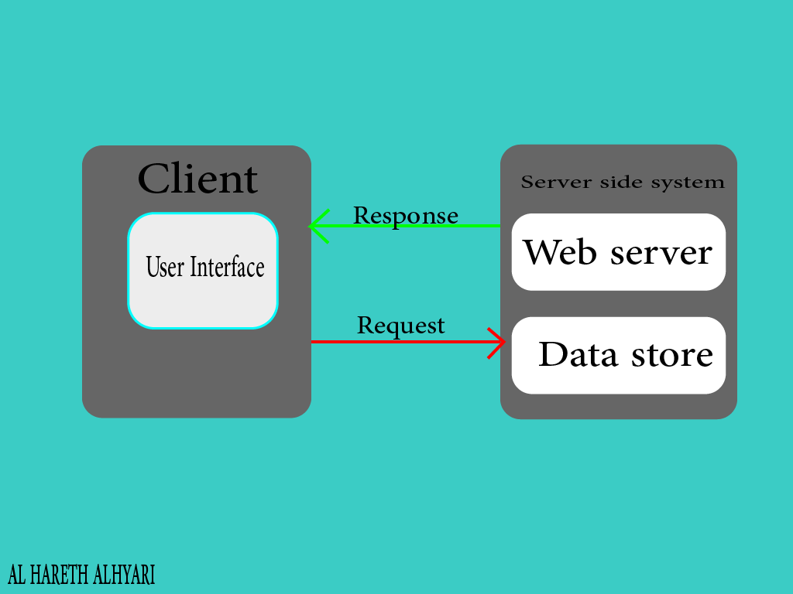

# Movies-Library-version1

**Author Name**: Al Hareth alhyari

## WRRC

## Overview
This project is a movie application to display movies and their characteristics such as overview, evaluation, and several other things. In this application version, I set up the server of the movie app with the basic structures.

## Getting Started
To build this app on your own machine and get it running you must follow this steps in your terminal:
1. Run git clone *SSD code from git hub*
2. Run touch server.js
3. Run npm init -y
4. Run npm install express
5. Run npm start in order to start the server running.

## Project Features
I made a Home Page with url and endpoint localhost:3000/ to displays the movise.
I made a favorite Page with url and endpoint whith path localhost:3000/favorite to displays the favorite movise.
and  last thing I made an error handlers:
for server error (state 500)
and to handle page not found error (status 404).