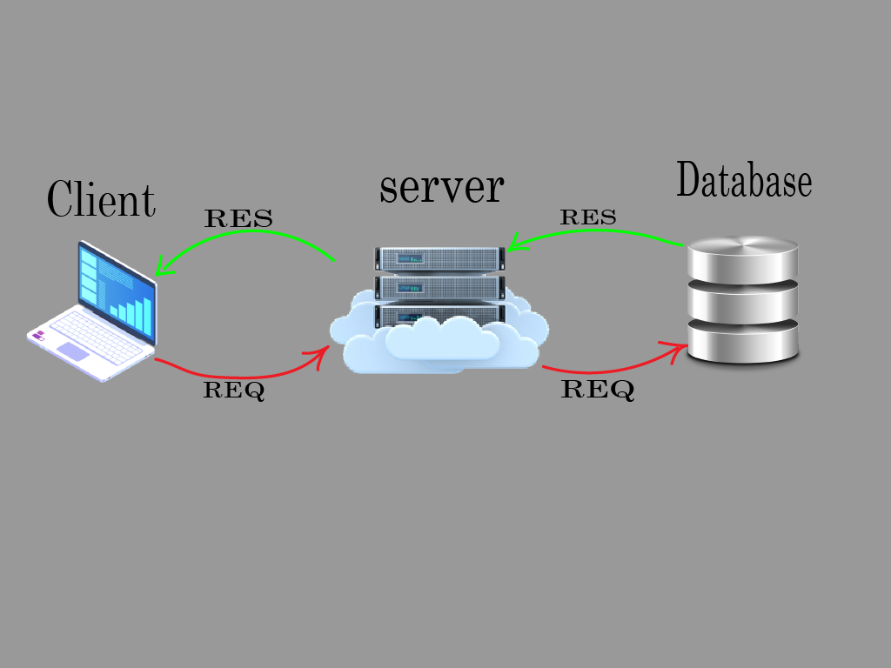

# Movies-Library-version1

**Author Name**: Al Hareth alhyari

## WRRC

## Overview
This project is a movie application to display movies and their characteristics such as overview, evaluation, and several other things. In this application version, I I brought the data to display in our server from the (TMDB) 3rd party API, so I did a request from my server to the (TMDB) 3rd party API server to git the data,in lab15 i made a DataBase and pass a table in it to get anw movie .

## Getting Started
To build this app on your own machine and get it running you must follow this steps in your terminal:
1. Run git clone *SSD code from git hub*
2. Run touch server.js
3. Run npm init -y
4. Run npm install express axios dotenv cors.
5. Run npm start in order to start the server running.
### lab 15 
Now we are using a Database then you have to follow this steps to build this app on your machine:

1. Install pg library.` npm i pg`
2. Require pg library in your server. `const pg = require('pg');`
3. Create an obj from Client and pass the URL of postgresql server.
`const client = new pg.Client('postgresql://localhost:5432/moviesdata')`
4. Connect the server with moviesdata database. `client.connect()`
5. `psql -d moviesdata -f schema.sql`
6. If you want to read data from post request method, use this middleware: `server.use(express.json())`

start postgerSQl server : `sqlstart`
stop postgerSQl server : `sqlstop`
_______________________________________
Open postgerSQL shell server (SSL mode) :`psql`
1. List all databases : `\l`
2. Switch to another database : `\c <db-name>`
3. List database tables : `\dt`
4. Describe a table : `\d <table-name>`
    - try " `SELECT * FROM table-name`
5. Quit : `\q`

## Project Features
- I made a a trending items Page with url and endpoint localhost:3000/trending to displays the trending movise.
- I made a search Page with url and endpoint whith path localhost:3000/search to displays the search Page.
- I made  a top rated movies Page with url and endpoint whith path localhost:3000/toprated to displays the top rated movies Page.
- I made  a Now playing movies Page with url and endpoint whith path localhost:3000/nowplaying to displays the now playing movies Page.
- and  last thing I made an error handlers:
- for server error (state 500)
- and to handle page not found error (status 404).

[database]: ./assest/Database-01.png